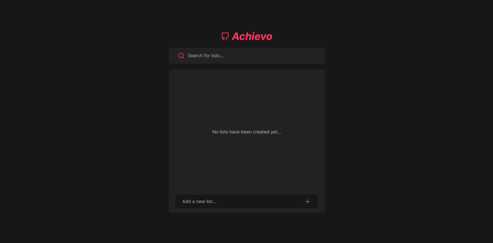
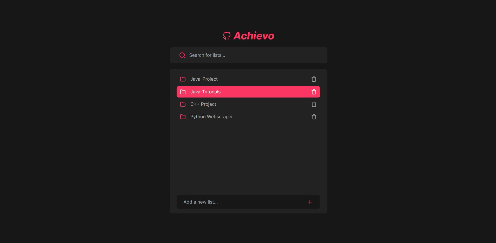
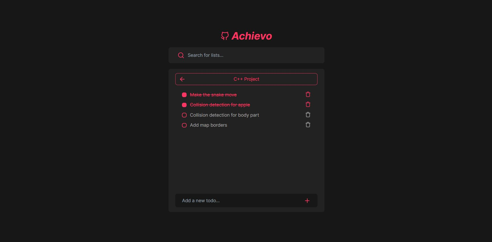
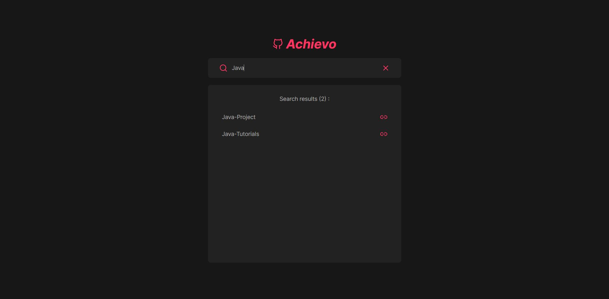

# TODO App ✨ - Using React and TailwindCSS

## Description

A simple todo app that allows you to create lists, each with its own todos.

## Screenshots

Here are some screenshots of the App:

## What I've Learned

- React hooks
- React states
- Searching and filtering
- Tailwind and formatting
- Local storage
